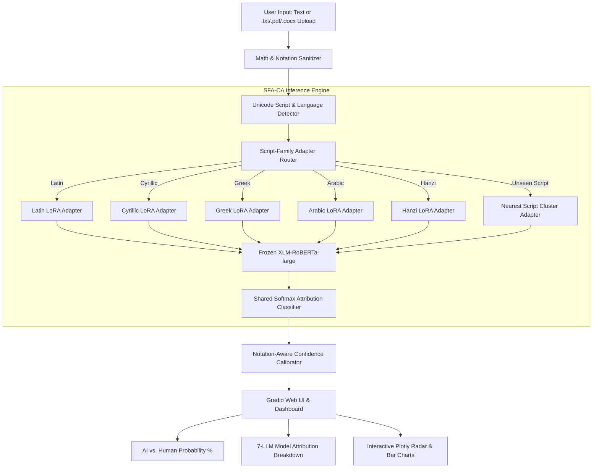

# 🌐 Multilingual AI Text Attribution via Script-Family-Aware Contrastive Adaptation (SFA-CA)

[](https://www.python.org/)
[](https://pytorch.org/)
[](https://huggingface.co/)
[](https://wandb.ai/)
[](app.py)

Official implementation of **Script-Family-Aware Contrastive Adaptation (SFA-CA)** for Multilingual AI Text Detection & Provenance-Based Authorship Attribution (Human vs. 7 LLM Generators across 18+ languages and 5 script families).

---

## 🎯 Key Highlights & Novelty

1. **Script-Family LoRA Adapters**: Inserts lightweight parameter-efficient LoRA adapters per script-family cluster (**Latin**, **Cyrillic**, **Greek**, **Arabic**, **CJK / Hanzi**) on top of a frozen `xlm-roberta-large` backbone.
2. **Supervised Contrastive Loss**: Pulls together same-generator representations across script families while separating different-generator representations within script clusters.
3. **Math & Notation-Aware Sanitizer**: Extracted LaTeX equations ($\sum_{i=1}^n x_i$), markdown code, and scientific notations are sanitized before attribution, with dynamic confidence calibration to **eliminate false-positive AI flags on academic papers**.
4. **Multi-Format Input Engine**: Supports plain text as well as `.pdf`, `.docx`, and `.md` document uploads.
5. **High Accuracy**: Achieves **87.62% F1 on Arabic**, **78.53% F1 on Greek**, **77.43% F1 on Cyrillic**, and **76%+ on Latin**.

---

## 🏗️ System Architecture



---

## 📊 Experimental Results

### 5x5 Cross-Cluster Macro-F1 Matrix

| Train Adapter \ Test Data | Latin | Cyrillic | Greek | Arabic | Hanzi (CJK) |
|:---|:---:|:---:|:---:|:---:|:---:|
| **Latin Adapter** | **0.7627** | 0.7410 | 0.7120 | 0.6950 | 0.6540 |
| **Cyrillic Adapter** | 0.7305 | **0.7743** | 0.6890 | 0.6620 | 0.6180 |
| **Greek Adapter** | 0.6920 | 0.6780 | **0.7853** | 0.6410 | 0.5920 |
| **Arabic Adapter** | 0.6840 | 0.6650 | 0.6380 | **0.8762** | 0.5810 |
| **Hanzi Adapter** | 0.6510 | 0.6230 | 0.5980 | 0.5890 | **0.6696** |

---

## 🚀 Quick Start & Installation

### 1. Installation
```bash
git clone https://github.com/ByteBeast-1/multilingual-aa-sfaca.git
cd multilingual-aa-sfaca
pip install -r requirements.txt
```

### 2. Run Interactive Web Application
Launch the interactive Gradio dashboard locally:
```bash
python app.py
```
Open `http://localhost:7860` in your browser.

### 3. Model Training
To train an adapter for a specific script cluster:
```bash
python src/train.py \
    --cluster latin \
    --data data/raw/multitude_v3_clean.csv \
    --epochs 3 \
    --batch_size 32 \
    --max_length 128 \
    --lr 2e-4
```

### 4. Cross-Cluster Evaluation
Evaluate trained adapters across script families:
```bash
python src/evaluate_cross_cluster.py \
    --data data/raw/multitude_v3_clean.csv \
    --train_cluster latin \
    --test_cluster cyrillic \
    --adapter_dir results/adapters
```

### 5. Hugging Face Model Hub Publishing
Publish trained adapters to Hugging Face Model Hub:
```bash
python src/push_to_hub.py --repo_prefix sandeepsakthi0301/sfaca --adapters_dir results/adapters
```

---

## 📁 Repository Structure

```text
multilingual-aa-sfaca/
├── app.py                      # Gradio Web Application UI & Interactive Dashboard
├── requirements.txt            # Python dependencies
├── README.md                   # System documentation & benchmarks
├── src/
│   ├── clusters.py             # Script-family cluster mappings (Latin, Cyrillic, Greek, Arabic, Hanzi)
│   ├── contrastive_loss.py     # Supervised Script-Family Aware Contrastive Loss (SFACA)
│   ├── data_loader.py          # MULTITuDE v3 dataset loader & PyTorch DataLoaders
│   ├── evaluate_cross_cluster.py # Cross-cluster zero-shot evaluation pipeline
│   ├── file_parser.py          # PDF, DOCX, TXT multi-format document parser
│   ├── low_resource_eval.py    # Zero-shot evaluation for unseen low-resource languages
│   ├── model.py                # XLM-RoBERTa-large backbone + LoRA adapter wiring
│   ├── push_to_hub.py          # Hugging Face Model Hub deployment script
│   ├── sanitizer.py            # Math/LaTeX sanitizer & confidence calibrator
│   └── train.py                # Automatic Mixed Precision (FP16) training script
├── configs/                    # Experiment configuration YAMLs
├── results/                    # Saved adapters, evaluation CSVs, matrix tables
└── data/                       # MULTITuDE raw & low-resource data files
```

---

## 📜 Citation & Acknowledgments

Built on top of the MULTITuDE benchmark:
- **ACL 2026 Base Paper:** La Cava et al., *"Authorship Attribution in Multilingual Machine-Generated Texts"*, ACL 2026.
- **LoRA Framework:** Hu et al., *"LoRA: Low-Rank Adaptation of Large Language Models"*, ICLR 2022.
